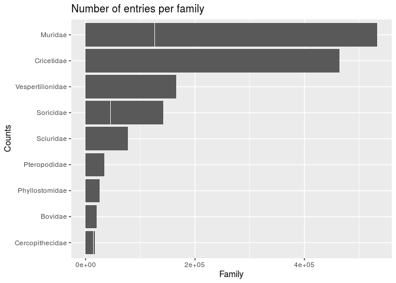
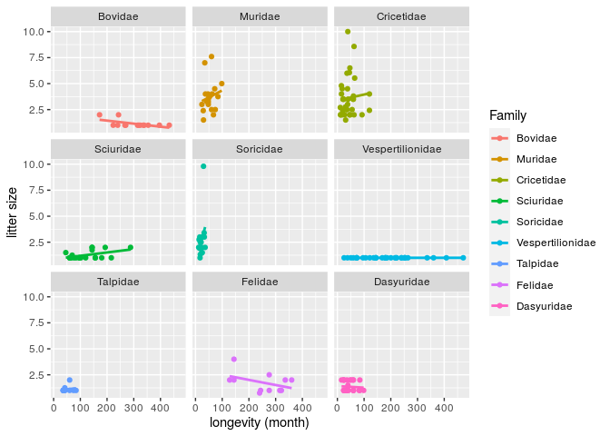

### Lire les donnees

```r
devtools::load_all()
```

```
## Loading Exos
```

```r
library(tidyverse) #autorise l'utilisation des pipes (%>%)

#bien mettre le here::here dans le Rmd
pantheria <- readr::read_delim(here::here("data", "pantheria-traits", "PanTHERIA_1-0_WR05_Aug2008.txt"), delim = "\t")
```

```
## 
## ── Column specification ───────────────────────────────────────────────────────────────────────────────────────────────────────
## cols(
##   .default = col_double(),
##   MSW05_Order = col_character(),
##   MSW05_Family = col_character(),
##   MSW05_Genus = col_character(),
##   MSW05_Species = col_character(),
##   MSW05_Binomial = col_character(),
##   References = col_character()
## )
## ℹ Use `spec()` for the full column specifications.
```

```r
pantheria
```

```
## # A tibble: 5,416 x 55
##    MSW05_Order MSW05_Family MSW05_Genus MSW05_Species MSW05_Binomial `1-1_ActivityCy… `5-1_AdultBodyM… `8-1_AdultForea…
##    <chr>       <chr>        <chr>       <chr>         <chr>                     <dbl>            <dbl>            <dbl>
##  1 Artiodacty… Camelidae    Camelus     dromedarius   Camelus drome…                3          492714.             -999
##  2 Carnivora   Canidae      Canis       adustus       Canis adustus                 1           10392.             -999
##  3 Carnivora   Canidae      Canis       aureus        Canis aureus                  2            9659.             -999
##  4 Carnivora   Canidae      Canis       latrans       Canis latrans                 2           11989.             -999
##  5 Carnivora   Canidae      Canis       lupus         Canis lupus                   2           31757.             -999
##  6 Artiodacty… Bovidae      Bos         frontalis     Bos frontalis                 2          800143.             -999
##  7 Artiodacty… Bovidae      Bos         grunniens     Bos grunniens              -999          500000              -999
##  8 Artiodacty… Bovidae      Bos         javanicus     Bos javanicus                 2          635974.             -999
##  9 Primates    Pitheciidae  Callicebus  cupreus       Callicebus cu…                3            1117.             -999
## 10 Primates    Pitheciidae  Callicebus  discolor      Callicebus di…             -999            -999              -999
## # … with 5,406 more rows, and 47 more variables: `13-1_AdultHeadBodyLen_mm` <dbl>, `2-1_AgeatEyeOpening_d` <dbl>,
## #   `3-1_AgeatFirstBirth_d` <dbl>, `18-1_BasalMetRate_mLO2hr` <dbl>, `5-2_BasalMetRateMass_g` <dbl>, `6-1_DietBreadth` <dbl>,
## #   `7-1_DispersalAge_d` <dbl>, `9-1_GestationLen_d` <dbl>, `12-1_HabitatBreadth` <dbl>, `22-1_HomeRange_km2` <dbl>,
## #   `22-2_HomeRange_Indiv_km2` <dbl>, `14-1_InterbirthInterval_d` <dbl>, `15-1_LitterSize` <dbl>, `16-1_LittersPerYear` <dbl>,
## #   `17-1_MaxLongevity_m` <dbl>, `5-3_NeonateBodyMass_g` <dbl>, `13-2_NeonateHeadBodyLen_mm` <dbl>,
## #   `21-1_PopulationDensity_n/km2` <dbl>, `10-1_PopulationGrpSize` <dbl>, `23-1_SexualMaturityAge_d` <dbl>,
## #   `10-2_SocialGrpSize` <dbl>, `24-1_TeatNumber` <dbl>, `12-2_Terrestriality` <dbl>, `6-2_TrophicLevel` <dbl>,
## #   `25-1_WeaningAge_d` <dbl>, `5-4_WeaningBodyMass_g` <dbl>, `13-3_WeaningHeadBodyLen_mm` <dbl>, References <chr>,
## #   `5-5_AdultBodyMass_g_EXT` <dbl>, `16-2_LittersPerYear_EXT` <dbl>, `5-6_NeonateBodyMass_g_EXT` <dbl>,
## #   `5-7_WeaningBodyMass_g_EXT` <dbl>, `26-1_GR_Area_km2` <dbl>, `26-2_GR_MaxLat_dd` <dbl>, `26-3_GR_MinLat_dd` <dbl>,
## #   `26-4_GR_MidRangeLat_dd` <dbl>, `26-5_GR_MaxLong_dd` <dbl>, `26-6_GR_MinLong_dd` <dbl>, `26-7_GR_MidRangeLong_dd` <dbl>,
## #   `27-1_HuPopDen_Min_n/km2` <dbl>, `27-2_HuPopDen_Mean_n/km2` <dbl>, `27-3_HuPopDen_5p_n/km2` <dbl>,
## #   `27-4_HuPopDen_Change` <dbl>, `28-1_Precip_Mean_mm` <dbl>, `28-2_Temp_Mean_01degC` <dbl>, `30-1_AET_Mean_mm` <dbl>,
## #   `30-2_PET_Mean_mm` <dbl>
```


### Nettoyer le dataset
Transformation en facteur de l'ordre et de la famille

```r
dat <- pantheria %>%
  mutate(order = as_factor(MSW05_Order), family  = as_factor(MSW05_Family)) %>% #ajoute ces deux colonnes
  janitor::clean_names() #permet de nettoyer les noms
```

Value -999 devient des NA, renommer les colonnes

```r
dat <- pantheria %>%
  mutate(order = as_factor(MSW05_Order), family  = as_factor(MSW05_Family)) %>% #ajoute ces deux colonnes
  rename(adult_bodymass = "5-1_AdultBodyMass_g",
         dispersal_age  = "7-1_DispersalAge_d",
         gestation      = "9-1_GestationLen_d",
         homerange      = "22-2_HomeRange_Indiv_km2",
         litter_size    = "16-1_LittersPerYear",
         longevity      = "17-1_MaxLongevity_m") %>%
         select(order, family, longevity, homerange, adult_bodymass, litter_size, dispersal_age, gestation) %>%
  na_if(-999) #met un NA si valeur = -999
dat
```

```
## # A tibble: 5,416 x 8
##    order        family      longevity homerange adult_bodymass litter_size dispersal_age gestation
##    <fct>        <fct>           <dbl>     <dbl>          <dbl>       <dbl>         <dbl>     <dbl>
##  1 Artiodactyla Camelidae        480      NA           492714.           1           NA      387. 
##  2 Carnivora    Canidae          137       1.01         10392.          NA          330.      65  
##  3 Carnivora    Canidae          192       3.13          9659.          NA           NA       61.2
##  4 Carnivora    Canidae          262      19.9          11989.          NA          255       61.7
##  5 Carnivora    Canidae          354      43.1          31757.           2          180       63.5
##  6 Artiodactyla Bovidae          314.     NA           800143.           1           NA      274. 
##  7 Artiodactyla Bovidae          267      NA           500000            1           NA      274. 
##  8 Artiodactyla Bovidae          319.     NA           635974.           1           NA      297. 
##  9 Primates     Pitheciidae       NA      NA             1117.          NA           NA      129. 
## 10 Primates     Pitheciidae       NA      NA               NA           NA           NA       NA  
## # … with 5,406 more rows
```


### Exploration des donnees
Consignes : How many observations in family? In order? What is the mean home range by family? Standard deviation? The sample size?


```r
dat %>%
  filter(!is.na(homerange)) %>% #permet d'enlever toutes les lignes avec NA sur les homerange, c'est mieux
  group_by(family) %>%
  summarise(moy=mean(homerange), sd=sd(homerange), n=n()) #n donne le nbr d'obs dans le groupe homerange(+ efficace)
```

```
## `summarise()` ungrouping output (override with `.groups` argument)
```

```
## # A tibble: 93 x 4
##    family             moy        sd     n
##    <fct>            <dbl>     <dbl> <int>
##  1 Camelidae    0.13       NA           1
##  2 Canidae     49.6       176.         21
##  3 Bovidae     44.6       159.         24
##  4 Pitheciidae  0.8         1.27        7
##  5 Didelphidae  0.0704      0.160      10
##  6 Dasypodidae  1.38        2.14        4
##  7 Muridae      0.00336     0.00839    35
##  8 Spalacidae   0.0000732  NA           1
##  9 Cricetidae   0.00305     0.00572    62
## 10 Erinaceidae  0.0255      0.0306      4
## # … with 83 more rows
```


### Premier graphe
Consignes : Group by family, and select only those with more than 100 observations. Make a bar chart of the number of observations per family. Order the bars by increasing number of observations. Add a title and labels to the X and Y axes.


```r
dat_family <- dat %>%
  group_by(family) %>%   # group by family
  mutate(n = n()) %>%    # calculate number of entries per family
  filter(n > 100) %>%    # select only the families with more than 100 entries
  
  ggplot() + #je mets d'abord mes donnees
  aes(x = n, y = fct_reorder(family, n)) +  #representation du nbr d'obs par famille
  geom_col() + #geometrie bar chart
  #coord_flip() pour echanger x et y
  xlab("Family") + # add label for X axis
  ylab("Counts") + # add label for Y axis
  ggtitle("Number of entries per family") # add title
dat_family
```

<!-- -->


### Deuxième graphe
Consignes : Filter out missing values in both litter size and longevity. Group by family, and select only those with more than 50 observations. Make a scatter plot of litter size as a function of longevity. Add a linear regression fit for each family. Split the plot in several scatter plots, one for each family. Add a title and labels to the X and Y axes.


```r
dat %>% filter(!is.na(litter_size), !is.na(longevity)) %>% #enlever les lignes avec littersize et longevity=NA
  group_by(family) %>% #groupe par famille
  mutate(n = n()) %>%  #calcul nbr d'entree par famille
  filter(n > 10)  %>%  #conserve que celle avec au moins 10obs

  ggplot()+
  aes(x=longevity, y=litter_size, col=family)+ #une couleur par famille
  geom_point()+
  geom_smooth(method="lm", se=F)+
  #regression lineaire par famille (car on mit dans aes, col=family), se=F permet d'enlever l'IC
  labs(x="longevity (month)", y="litter size")+
  facet_wrap( ~ family, nrow = 3)+             #permet de splitter le plot par famille
  guides(color=guide_legend(title = "Family")) #ca marche mais c'est lourd
```

```
## `geom_smooth()` using formula 'y ~ x'
```

<!-- -->

